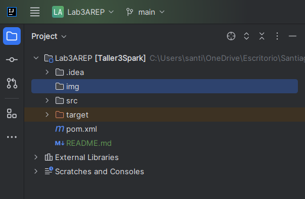

### Escuela Colombiana de Ingeniería

### Arquitecturas Empresariales

#### TALLER 2: MICROFRAMEWORKS WEB

#### Santiago Arévalo Rojas

### Instrucciones para ejecución

Para ejecutar la aplicación se deben seguir los siguientes pasos:
1. Se debe clonar el repositorio de github con el enlace dado en la entrega, el cual es: [https://github.com/santiarojas18/Lab3AREP.git](https://github.com/santiarojas18/Lab3AREP.git)
2. Una vez clonado se debe abrir el proyecto en el IDE de preferencia, en este caso se abrió en IntelliJ:  
   
3. 